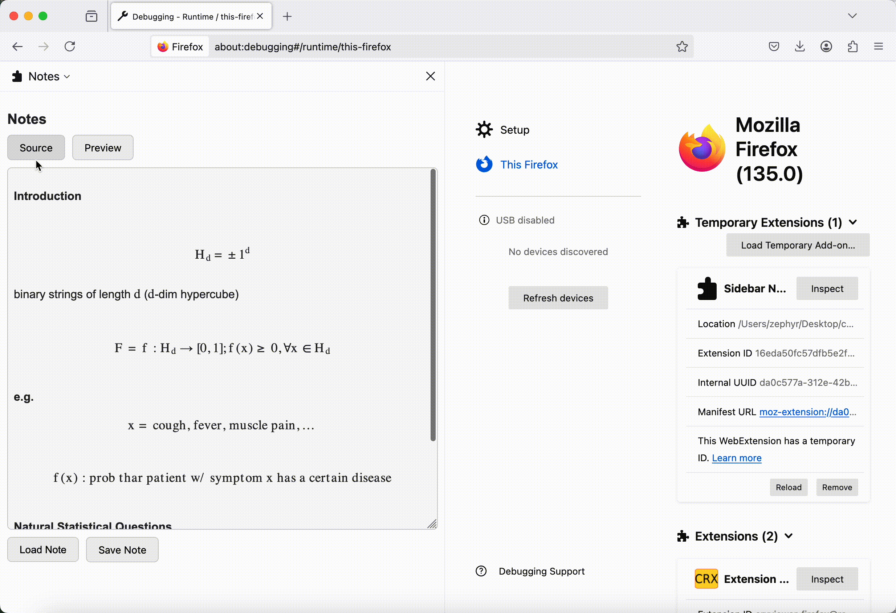

    

**A note taking extension for Mozilla Firefox**

## Introduction

Quick Notes is an extension designed for [Mozilla Firefox](https://www.mozilla.org/en-US/firefox/). With Quick Notes, you can open a sidebar, take notes with Markdown and LaTeX support, and save and load them whenever you want!

## Markdown \& LaTeX support 

Quick Notes supports most of the Markdown and LaTeX syntax. These functions are powered by open source JS packages [Marked](https://github.com/markedjs/marked)(Markdown rendering) and [MaxJax](https://github.com/mathjax/MathJax)(LaTeX rendering).

## Seamless Switch Between Modes

Quick Notes provides source mode and preview mode. You can toggle to switch between the two modes seamlessly (just as you can on github).

## Free Resize of Window

## Save \& Load Notes

You can save \& load your notes on Quick Notes whenever you want! Due to file system write access restriction on JS scripts, this is powered by `browser.downloads` API provided by firefox.

## Friendly UI

## Open Source Project Best Practices
We adopted the best practices of open source projects in Quick Notes, including [README.md](README.md), [MIT LICENSE](LICENSE), [Code of Conduct](CODE_OF_CONDUCT.md) (adopted from Contributor Covenant Code of Conduct), and [Contribution Guidelines](CONTRIBUTING.md).

## Our Team
- [Yufeng(Felix) Xu](https://zephyr271828.github.io/)
- [Haocheng(Jason) Lu](https://github.com/LuHC409)
- [Alvaro Martinez](https://github.com/AlvaroMartinezM)

