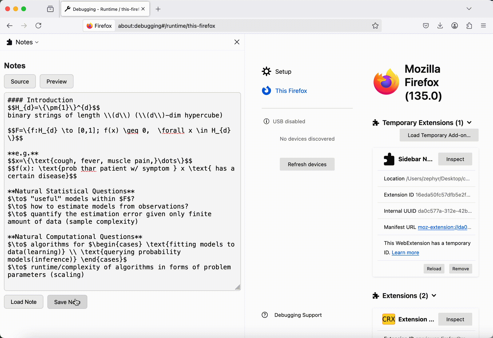

<div align="center">
    

**A note-taking extension for Mozilla Firefox**
</div>

## About

**Quick Notes** is a [Mozilla Firefox browser](https://www.mozilla.org/en-US/firefox/) extension project by Team 5 in [CSCI-UA 480 Open Source Software Development, Spring 25](https://cs.nyu.edu/~jk157/ossd_s25/). In this extension, you can open a sidebar, take notes, save and load notes locally whenever you want!

## Highlights
- Supports Markdown and LaTeX syntax
- Separate panels for note source code and preview
- Save and load notes to whichever local path you want

## Deployment
- Clone this project:
```sh
git clone git@github.com:ossd-s25/Quick-Notes.git
```
- Open your Firefox browser (if you don't have one, download it [here](https://www.mozilla.org/en-US/firefox/))
- Go to [debugging - setup](about:debugging#/setup)
- Click 'Load Temporary Add-on...'
- Select the path to `manifest.json` in your local copy of this repo
- Start taking notes!

## Markdown & LaTeX Support  
  

### Markdown  
Quick Notes allows you to write and render Markdown syntax, making it easy to format text, add lists, insert links, and more. The rendering is handled by the open-source JS package [Marked](https://github.com/markedjs/marked).  

### LaTeX  
LaTeX syntax is supported for mathematical expressions and equations, enabling seamless integration of formulas. This functionality is powered by [MathJax](https://github.com/mathjax/MathJax).  

## Seamless Switch Between Modes  
  
Quick Notes provides source mode and preview mode. You can toggle to switch between the two modes seamlessly (just like on GitHub).  

## Free Resize of Window  
  

You can freely resize the text box to adjust its width and height according to your needs.

### How It Works:
- **Drag left or right** with your mouse to adjust the width.
- **Drag downward** to extend the height for more writing space.

This feature provides flexibility, allowing you to customize the note-taking area for better readability and convenience.

## Save & Load Notes  
  
You can load your notes from any file of your choice using the **Load** feature. This allows you to open previously saved notes from your system and continue editing them.

### How It Works:
1. Click the **Load** button.
2. Select the file you want to open.
3. The content will be loaded into Quick Notes for further editing.

This feature provides flexibility by allowing you to choose files from any directory.

### Save Notes with Custom Path Selection  

You can save your notes and choose where to download them on your system.

### How It Works:
1. Click the **Save** button.
2. Choose the location where you want to save the file.
3. The file will be downloaded to your selected path.

Due to file system write access restrictions on JavaScript scripts, this is powered by the `browser.downloads` API provided by **Firefox**.

## Undo Changes  
  

You can undo changes in Quick Notes using **Ctrl + Z** to revert your last edits.

### How It Works:
- Unlike built-in system undo functions, this feature is implemented using a **stack**.
- Every change is stored in the stack, allowing you to **undo continuously** until you reach the initial state.
- This ensures that even after multiple edits, you can always go back to the starting point.

With this functionality, you can easily correct mistakes and restore previous content efficiently.

## Open Source Project Best Practices  
We adopted the best practices of open-source projects in Quick Notes, including [README.md](README.md), [MIT LICENSE](LICENSE), [Code of Conduct](CODE_OF_CONDUCT.md) (adopted from Contributor Covenant Code of Conduct), and [Contribution Guidelines](CONTRIBUTING.md).

## Links  
### Documents  
- [Contribution Guidelines](CONTRIBUTING.md)  
- [Code of Conduct](CODE_OF_CONDUCT.md)  

### Credits  
- [Marked](https://github.com/markedjs/marked)  
- [MathJax](https://github.com/mathjax/MathJax)  
- [Icon](https://icons8.com/icon/15042/create)  

## Contributors  
- [Yufeng (Felix) Xu](https://zephyr271828.github.io/)  
- [Haocheng (Jason) Lu](https://github.com/LuHC409)  
- [Alvaro Martinez](https://github.com/AlvaroMartinezM)  
